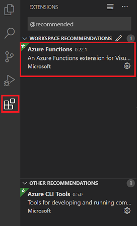

# Lab 2 Part 2 - Azure Functions Local Development - Core Tools

## Lab Summary

Contoso Cabs is evaluating Node.js based Azure Functions for use in a driver lookup API. In this lab we will create a simple proof-of-concept.

In this lab, we're going to:

1. Create a new Functions project using Core Tools
1. Create a new JavaScript based HTTP Trigger Function
1. Run and debug the Function

## Step 1: Create a new Function Project

With Core Tools, we'll use the PowerShell to interact with Functions:

- Open `PowerShell` or `PowerShell Core (v6.0 or v7.0)`. You can also use the Command Line (`cmd`) if you're more comfortable there.
- Navigate to an appropriate directory, and create your Functions project:

```PowerShell
func init DriverAPI
```

Core Tools will ask you which framework you want to use. Select `node` and use `javascript` as the language. A new directory and git repo will be created ready for your project.

- Navigate into the new directory:

```PowerShell
cd DriverAPI
```

- Now create a new JavaScript Function using the HTTP Trigger template:

```PowerShell
func new --template "Http Trigger" --name DriverLookup
```

- Core Tools will create the dummy Function. Let's take a look into the project with VSCode:

```PowerShell
code .
```

> Visual Studio Code will open the project folder. If it asks you to install recommended extensions, select `Install All` (this will install the Azure Functions tools for VS Code) or if it asks if you want to update the extension version, select Yes. You may need to restart VS code. You may also be prompted to initialise for optimal use with VS Code. Again, select Yes.

> If you don't have the Azure Functions extension installed, and you are not prompted to do so, select the extensions section and search for `Azure Functions`  


- Open the DriverLookup Function `index.js` file:  

  

We'll change the code in the Function to make it *slightly* less boring:

  ```JavaScript
      context.log('JavaScript HTTP trigger function processed a request.');

      var driverId = req.query.driverId;

      // fake a database...
      var drivers = [{
          id: 1,
          name: "Billy Bunter",
          numberStars: 4,
              dateStarted: new Date("2017-01-02")
          },
          {
              id: 2,
              name: "Fred Basset",
              numberStars: 5,
              dateStarted: new Date("2015-08-15")
          },
          {
              id: 3,
              name: "Denis T. Menace",
              numberStars: 2,
              dateStarted: new Date("2018-08-08")
          }
      ]

      var driver = drivers.find(o => o.id == driverId);

      if(driver){
          context.res = {
              body: driver
          };
      }else{
          context.res = {
              status: 400
          }
      }

      context.done();
  ```

> *👆 Notice in this code we're using a static list of driver objects, and accepting a `driverId` parameter from the query string. If we have a driver to return, we return one - else we return a `400` error to the browser.*

## Step 2: Run and call the Function

VS Code actually sets up a lot of the plumbing to allow us to run and debug the function.

Hit `F5` in VS Code.
You should see the Functions Runtime ASCII art as the runtime starts in the `Terminal` window in VS Code:


Now we can call it...

- Open a web browser, and open the URL <http://localhost:7071/api/DriverLookup?driverId=1> (if you've followed the above steps closely).
- All being well, you'll see:  

  

To debug the Function, set a breakpoint in VS Code. It should attach as you'd expect:


Once done testing, press `Shift + F5` to stop debugging.

## Step 3: Deploy to Azure

Before we deploy our Function we'll need to make it anonymously accessible, to avoid us needing a key to call it. We'll discuss Function security in depth in another module. For now, open the `function.json` file, and change the `authLevel` attribute to `anonymous`:


Now we'll use VS Code to deploy our Function to Azure. This works a little differently to Visual Studio, but with the Azure Functions extension VS Code will guide you through the process.

- In the left hand panel in VS Code, you should see an Azure tab. Expand it and click `Sign in to Azure`:  

  

>*Note: The tabs will probably appear on the left for you. I moved my panel to the right hand side.*

Follow the prompts to sign in via a web browser.

### Create a new Function App

- Click the Azure tab in the left hand panel  

  

- Now click `Deploy to Function App`:  

  

- The Action bar at the top of the window will guide you through the deployment:
  - Select the Subscription you want to deploy to (*Note: If you have only one subscription, this step will be skipped*):  

    

  - Create a new Function App to deploy into:  

    

  - Enter a name for the App Hosting Plan (this will be the ***.azurewebsites.net URL):  

    

  - Select `Node.js 14 LTS` when prompted:  

    

  - Select a close location when prompted (UK South or UK West are good options):  

    

> *It will take a few moments whilst the new Function application is created. Note that because we only provided a name for the application, other settings such as consumption plan and storage account names have been chosen for us. In practice it's probably best to create all of these upfront then select an existing Function app to deploy into rather than choose to create one at deploy time.*

VS Code will now deploy our Function code - and you'll see the results in the output panel:


Now all that's left is for us to call our live Function.

- Open a browser and navigate to <http://your-app-name-here.azurewebsites.net/api/DriverLookup?driverId=1>

## Summary

In this lab we've taken a brief tour of Functions Core Tools, and used them to create a new JavaScript Function. We've used a different IDE, host platform and language to make it, and we've deployed to the Cloud again.
