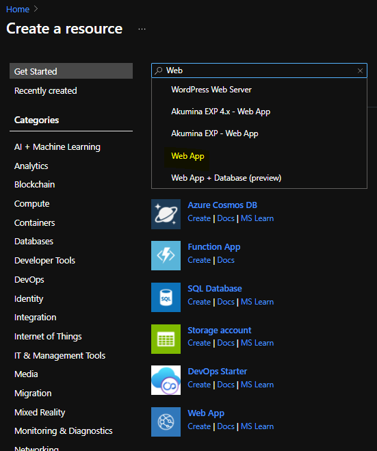
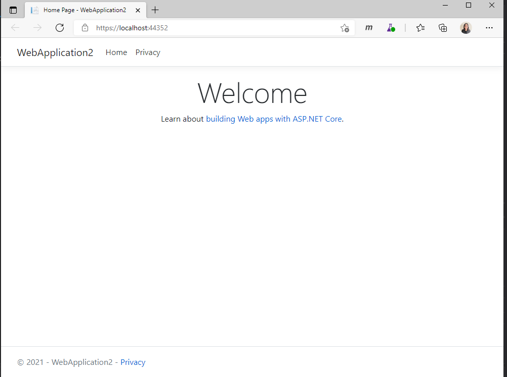
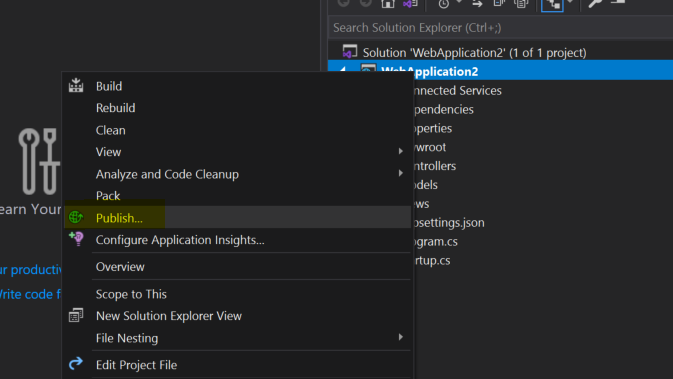
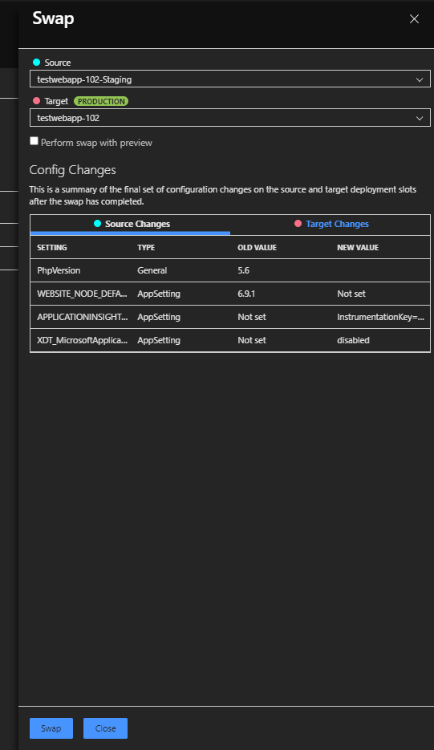

# Lab Summary

[Back to Main Menu](../../../README.md)

In this lab we'll create a new App Service Plan and Web App in Azure, publish our app to it and experiment with deployment slots.

## Create the Hosting platform (App Service Plan)

In this step we'll create an App Service Plan in Azure. This will be the hosting environment where our web app will run from.  A single App Service Plan can potentially contain multiple web apps.

1. In the Azure portal [https://portal.azure.com](https://portal.azure.com) goto "+ Create a resource"
2. In the New blade do a search for "App Service Plan"
3. Choose App Service Plan from the list of search results, and click "Create"
    1. Choose to create a new Resource Group, e.g. azurerampup-webapplab-rg
        - If you are working in the same subscription as others you may find this resource group already exists, in which case reuse it.
    1. Give your plan a unique name, e.g. appserviceplan-_nnn_
        - where _nnn_ is replaced by a unique number, e.g. 001
    1. Set the operating system to *Windows*
    1. Choose the UK South region
    1. Under *Pricing Tier*, click **Change Size**. Choose the "Free" pricing tier (F1, found in the Dev/Test tab)
4. Click Review + create
5. Click Create

The app service plan will take approximately 30 seconds to be provisioned.

## Create the Web App

In this step we'll create an Azure web app in the app service plan we created above.

1. Again, goto "+ Create a resource"
1. In the New blade do a search for "Web App" (you may also see it listed under the Popular list)

  
1. Click Create
    1. Reuse the Resource Group created in the step 3.i above
    1. Give your web app a unique name, e.g. azurerampup-webapp-_nnn_
        - where _nnn_ is replaced by a unique number, e.g. 001
    1. Select
        Publish:          Code
        Runtime Stack:    .NET 5
        Operating System: Windows
        Region: UK South
    1. Under "App Service Plan" select your app service plan create previously (Step 3 above).
    1. Click 'Monitoring' tab and ensure Application Insights is Disabled 
1. Click Review + create
5. Click Create

The web app will take approximately 30 seconds to be provisioned.

## Create a blank .NET-Core Web App

Using Visual Studio, next we're going to create a blank .NET Core web app. This is going to be our application which we will publish to the cloud.

1. Using Visual Studio, create a new ASP.NET Core Web Application (MVC) project.
    - Open Visual Studio, select 'Create a new project'
    - In the search box, search for template, 'ASP.NET core web app (Model-View-Controller)'
    - From the search results, select 'ASP.NET core web app (Model-View-Controller)' and click 'Next'
    - Provide a name for your project, e.g. WebApplication1
    - Click 'Next'
    - Choose Target Framework as '.NET 5.0 (Current)'
    - Ensure "Enable Docker Support" is unchecked
    - Leave other options as default and click 'Create'
1. Build the project and run it locally to ensure the project has built correctly (From Debug -> Start Debugging)
  

## Publish the application

Now we're going to publish our web app using the "publish" functionality available in Visual Studio.

*NOTE:* In a real-life scenario one would typically not publish directly from Visual Studio. Instead we'd prefer to check-in our code to a code repository, and use a CI/CD (continuous integration, continuous deployment) pipeline to build our code, run unit tests, and to deploy it to our environments. But for this demonstration we do not want to get bogged-down in the details of setting-up a full build-and-release pipeline.

1. Right-click the project in the Solution Explorer, and choose 'Publish...'
  
 
1. From the pop-up select Target as Azure and click 'Next'
1. Select Specific Target as 'Azure App Service (Windows)' and click 'Next'
4. Choose the correct Subscription name (you are working on for this Workshop)
4. Under App Service instances, expand the right Resource Group and select the web app created previously (e.g. azurerampup-webapp-001)
6. Click 'Finish'
7. Click 'Publish'

Your application will now be built, packaged and deployed to Azure hosted in the web app you selected. Once the web app has been published, Visual Studio will automatically open the URL to the Azure Web App in your default browser.

You can navigate to it yourself via the URL: [http://azurerampup-webapp-001.azurewebsites.net/](http://azurerampup-webapp-001.azurewebsites.net/)
(or similar, as per your web app name).

## View your deployment in the file system (using Kudu)

Kudu is an advanced tool which gives you access to the hosting platform for web apps. Through it you can explorer the file system, view the system process tree, view log files, and perform various administration and debugging tasks.

1. In the portal goto your App Services' blade
    - Search for you web app, by name (e.g. azurerampup-webapp-001), in the top search bar in Azure
1. In the left-hand menu of the Web App blade, scroll down to Development Tools -> Advanced tools
1. Hit Go ->

This will open a new web page with Kudu. There are various resources to explore here. Spend some time exploring what tools are available. To get to a console and to explorer the file system:

1. From the top menu select "Debug console", and choose CMD (you could open the console with Powershell loaded if you prefer).
1. The current directory is shown in upper table, whilst below there is a console window from which you can navigate the file system, and run commands.
1. Change the directory to the site\wwwroot folder:
    - `cd C:\home\site\wwwroot`

Inside this directory you can view the content of your web application. After publishing from Visual Studio this is the built assembly of your application (e.g. WebApplication1.dll), and the various other artefacts (e.g. web.config, appsettings.json, etc)

**If time allows, you may also complete the tasks below.**

## Using Deployment Slots

The next steps will demonstrate how to use deployment slots with web apps. Slots are basically new web sites with their own IP address and hostname which can be swapped on demand with the production web site.

## Setup a new "Staging" deployment slot in your Web App

1. In the portal, select your web app (e.g. azurerampup-webapp-001)
2. On the blade of your web app choose "Deployment slots"
    - Because your application is currently hosted on the Free (F1) app service plan tier, and because deployment slots are only available from the Standard (S1) tier upwards you will be prompted to upgrade the app service plan.
    - Upgrade the app service plan to Standard (S1) under the Production tab.
    - Click 'Apply'
1. Return to the web app's 'Deployment slots' blade. (possibly refresh if required)
1. From the top menu choose "+ Add slot"
    - Give your slot a name, e.g. "Staging"
    - Click Add

## Modify a page in your the App

1. In Visual Studio, navigate to folder, 'Views -> Home' and double-click on the file Index.cshtml to open it.
2. Add the following line at the end of the existing code.

```HTML
<div class="jumbotron">Hello world!</div>
```

## Publish the new version to the "Staging" deployment slot of the Web App

1. Right-click the solution and "Publish..."
1. Do not press the publish button (yet). Instead select "+ New"
1. From the pop-up select Target as Azure and click 'Next'
1. Select Specific Target as 'Azure App Service (Windows)' and click 'Next'
4. Choose the correct Subscription name (you are working on for this Workshop)
4. Under App Service instances, expand the right Resource Group 
7. From the list of available Azure Web Apps, select your web app (e.g. azurerampup-webapp-001), but expand the tree to show the deployment slots, and select the "Staging" slot.
6. Click 'Finish'
7. Click 'Publish'


## Test the new version of your application in the staging slot

Your application will now be published into the deployment slot instead of the main app, which will remain live and unchanged as it was before.  The deployed application in the Staging slot will open in your default browser.

The staging slot can be viewed via a slightly modified URL: (e.g.)
[https://azurerampup-webapp-001-staging.azurewebsites.net/](https://azurerampup-webapp-001-staging.azurewebsites.net/)
Note the inclusion of "`-staging`" in the URL now.

Your application will continue to run at: [https://azurerampup-webapp-001.azurewebsites.net/](https://azurerampup-webapp-001.azurewebsites.net/)

Once you are happy that the application is running correctly and that the changes you have made are suitable you can swap the slots to make your new version live.

## Swap the slots to make the most recent version live

- In the Azure portal, from your web app's blade, select 'Deployment slots' and click 'Swap'
- Ensure the Source is the staging slot and Target is the Production slot
- Click 'Swap'. Clicking this will swap your Staging and production slot. Congratulations your changes are now live.

  
- If you return to the Staging slot you'll notice that it contains the old version of your application. If you ever want to "roll back" a slot-swap you simply need to swap the slots again.
