# Lab 1 - Introduction to Azure Functions

[Back to Main Menu](../../../README.md)

## Lab Summary

In this lab we'll be creating a 'Hello World' Function, using the Azure Portal.

At the end of this lab you'll understand how to create a new Function App and Function using the Portal, and how to navigate around.

## Step 1: Create a new Function App

Head over to [https://portal.azure.com](https://portal.azure.com) and log in.

- Click `Create a resource` from the menu in the top left.  
  
  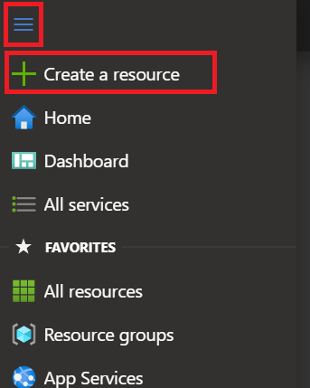

- Search for 'function' - choose `Function App` then click Create. A form will be displayed allowing you to enter the details of the Function App.
- Select `Create new` under the Resource Group option. Enter a name for the resource group and click `OK`.  
  
  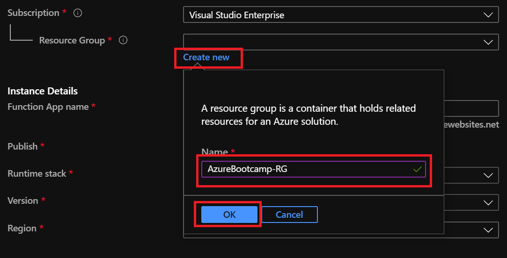

- Enter a name for the function app.

> ⚠ **Note** Function App Names must be unique. Try prefixing the name of the Function App with your initials.

- Complete the remaining details as follows then click `Next: Hosting`:  
  
  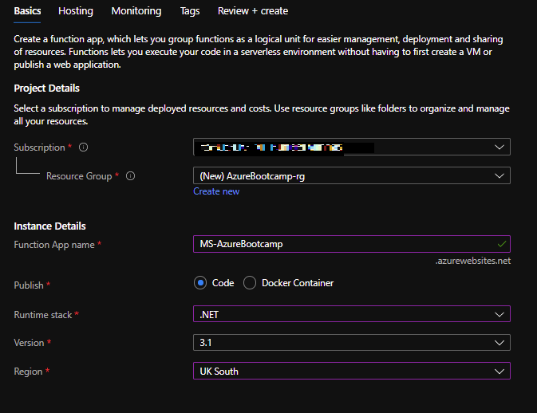

- Accept the default settings for hosting. These are:
  - The storage account that function files will be stored in.
  - The Operating System being used to host the Fucntion App. We will use Windows.
  - The Plan - we will use the Consumption Plan.
- Click `Next: Monitoring`
- Ensure `Enable App Insights` is set to `Yes` and accept the default name then click `Review + Create`  
  
  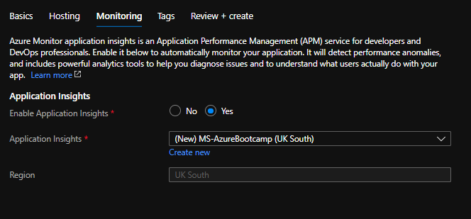

- Click `Create`. Azure will create a new Function App in the background, and notify you when it's ready:  

  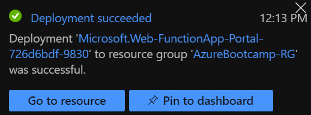

- Click `Go to Resource` to navigate to your new Function App.

## Step 2: Add a new Function

Now we have a Function *App*, we need to add a Function into it. Each Function App can contain many Functions.

> ⚠ **Note** The Function *app* is the unit of deployment and scale. Be aware that all functions within a function app can access the same configuration, secrets, storage and data as each other.

- Navigate to the newly created Function App
- Click the **`➕Add`** button to add a new Function:  

  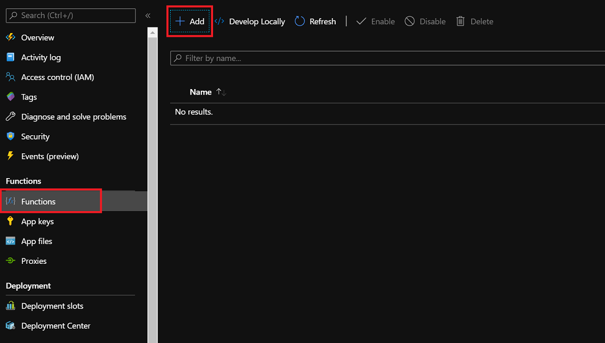

- Now click on: **HTTP Trigger**.  

  

- Next, accept the default name and Authorization level and click **Add**.  

  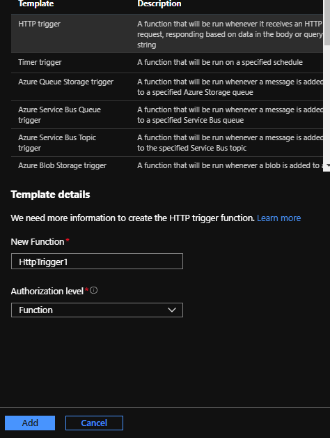

> **Note** In the Portal, the C# Functions are actually C# Script - .csx. The Function App is compiled at run time. We'll be looking at local, pre-compiled functions later in the course.

## Step 3: Explore and Run your Function

- Once the function has been created, click `Code + Test`  

  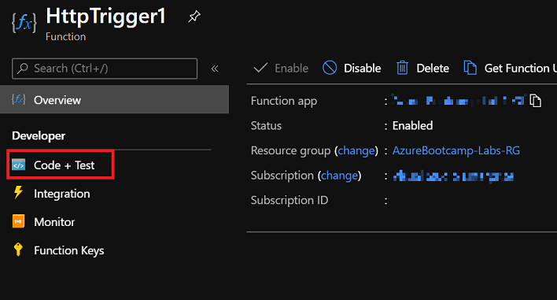

Have a look at the new Function that's been created. *What does it do?*

This Function accepts a `HttpRequest` object from the runtime, and uses that to get the Query String parameters, or content from the message body. It takes the `name` parameter and echoes out a Hello message to that name.

- Click `Test/Run`, click `+Add parameter` and enter the parameter name `name` and your name as the value. Then click `Run`.  

  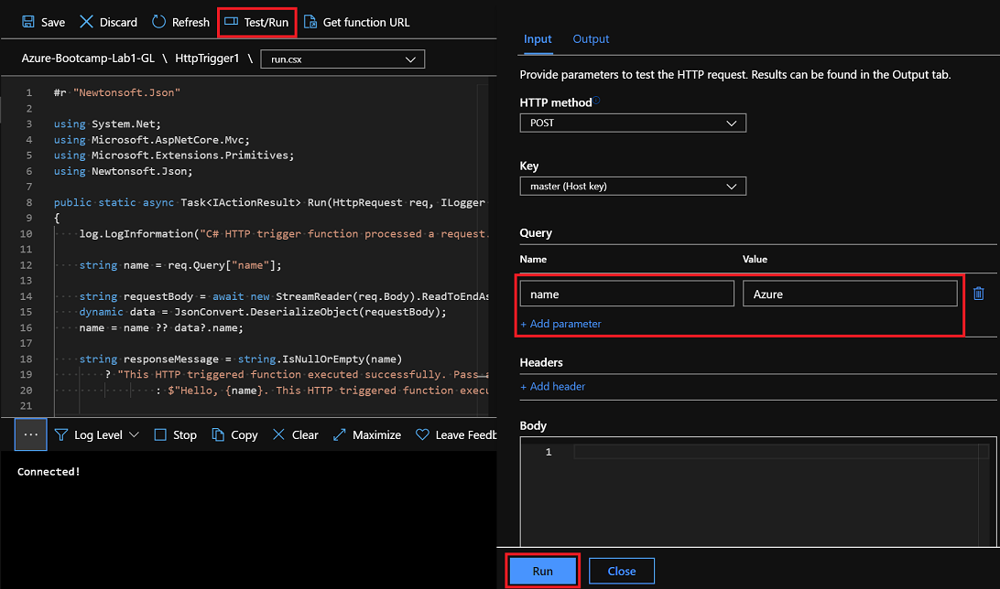

- Explore the various panels in the browser - we've got the code, a testing panel and output logs:  

  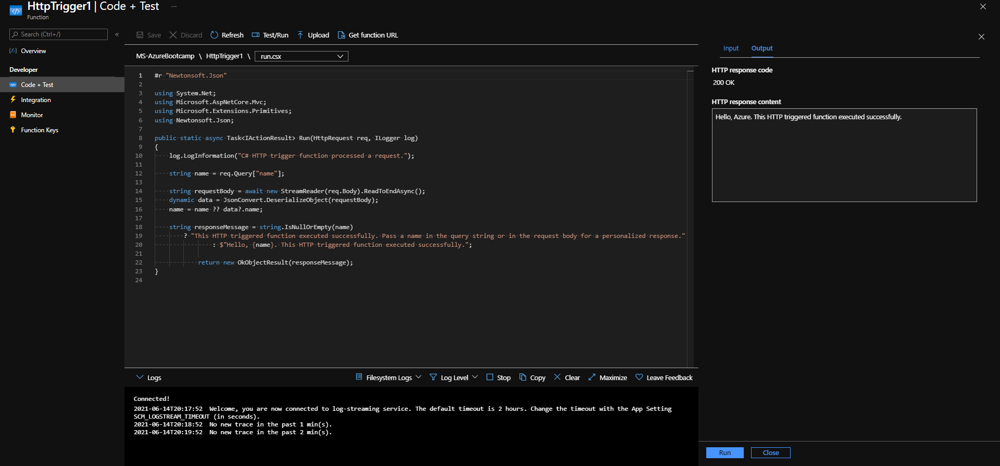

- Since this is a Http Triggered Function, we can also run it directly in the browser. Click `Get Function URL`:  

  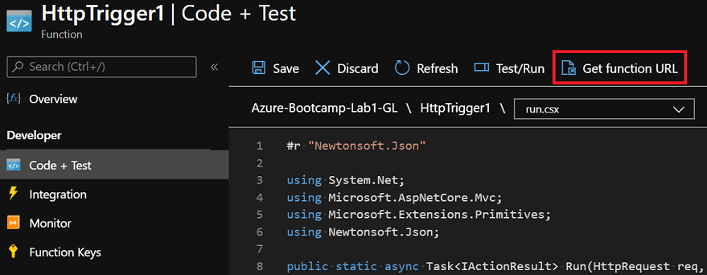

- Copy the URL to the clipboard  

  

- Paste the URL into a new tab. Add `&name=My-Name-Here` to the end of the URL:  

  

- Now try and make a change to the text that is echoed out to the browser. Save your Function and see your change made.

## Summary

In this lab you've used the Azure Portal to create a new Function App, add a templated Function and executed it.
