# Lab 2 Part 1 - Azure Functions Local Development - Visual Studio

[Back to Local Development Lab](Lab2-Index.md)

## Lab Summary

Contoso Cabs offer discounts to long-term customers. In this lab you will create and test a simple API Function which returns a discount percentage based on the customer start date.

In this lab, we're going to:

1. Create a new Functions project in Visual Studio
1. Create a new class library to contain some business logic.
1. Write unit tests for the business logic *and* our Function
1. Deploy our Function to Azure

## Step 1: Create a new Function Project

- Open Visual Studio 2019, and select `Create a new project`.  
  
  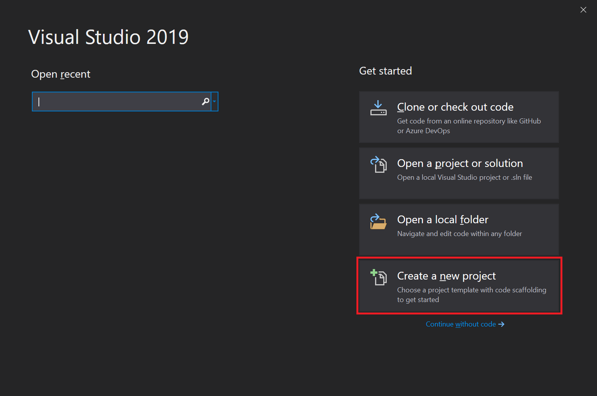

- Enter `Function` in the search box, select the Functions template and press Next  

  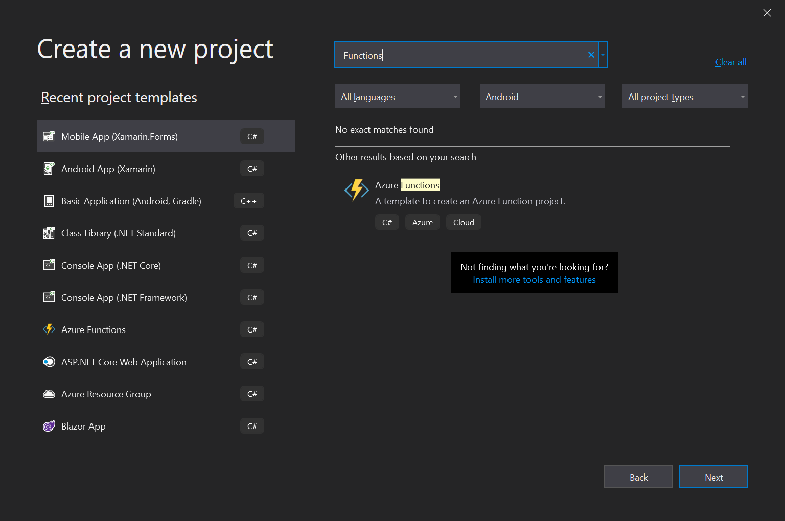

- Name the project `DiscountManager` and press Create.  

  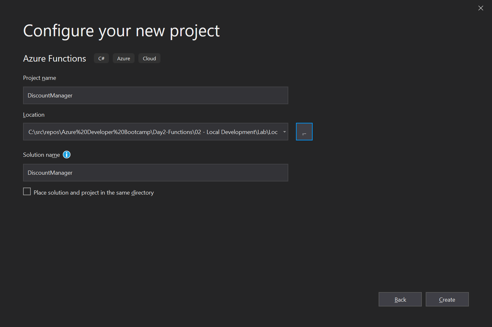

- Select the `Empty` template, to prevent creating anything at the outset. Ensure `Azure Functions v3 (.NET Core)` is selected.  

  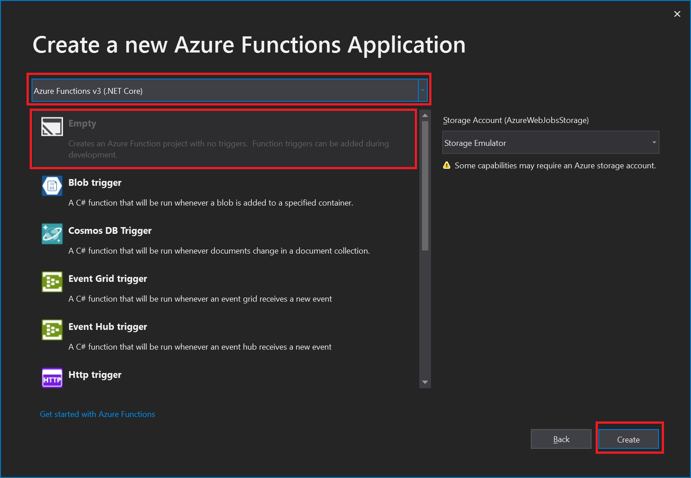

- Right click on your new project and select `Add -> New Azure Function`:  

  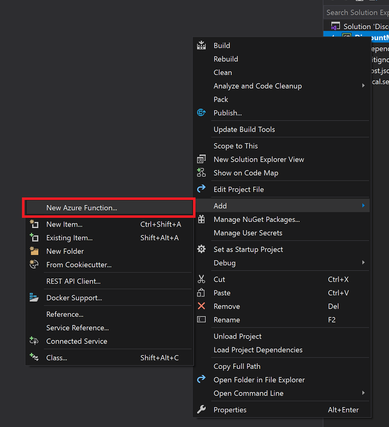

- Name the new Function `GetDiscount` and click `Add`  

  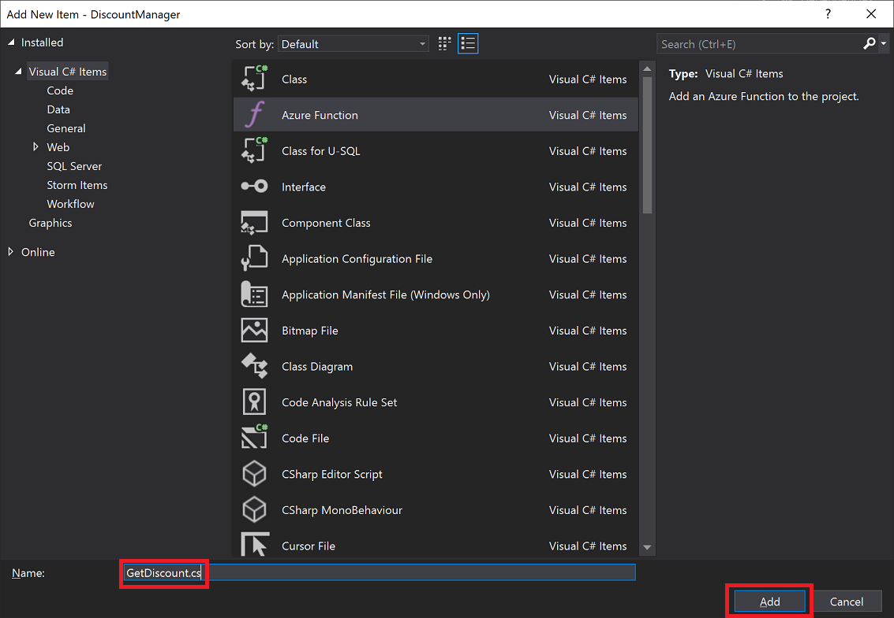

- Select the `Http trigger` template. **Make sure to change the `Access Rights` setting to `Anonymous`.**  

  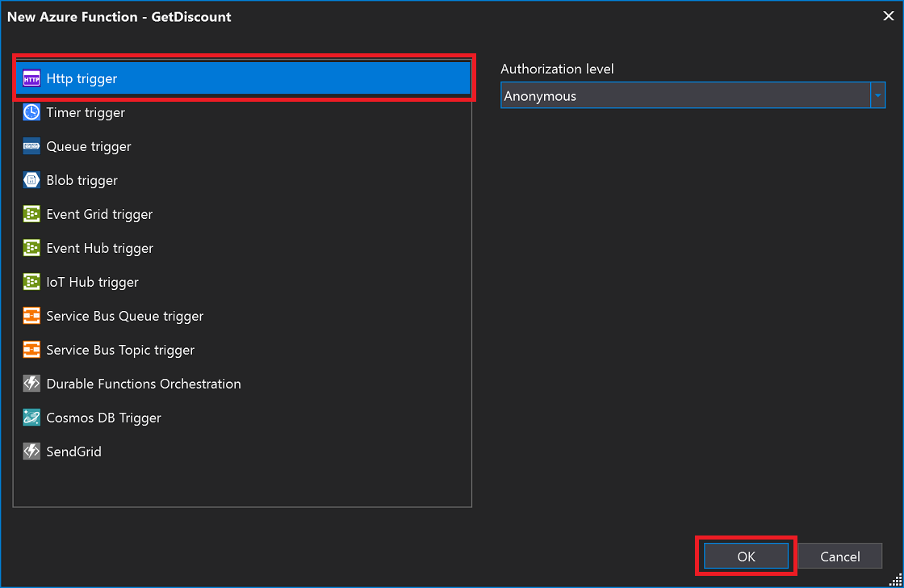

- The Functions tools will generate a new Function for us, containing some dummy logic to echo the ?name parameter back to the user. Let's make sure it works so far - hit `F5` to run your project locally:  

  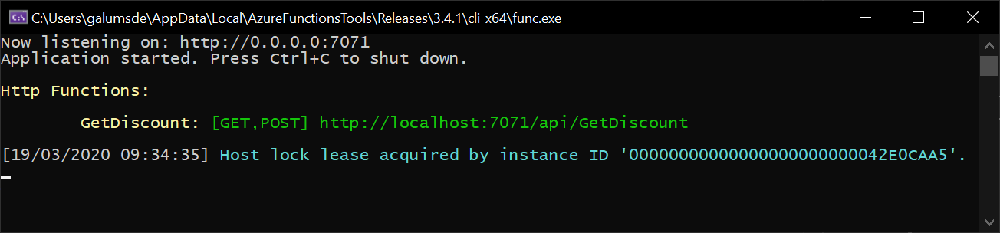

> *👆 Notice that the runtime starts up and loads our Function. It also tells us the URL of each Function - in this case `http://localhost:7071/api/GetDiscount`*.

- Load the above URL in a browser, and add `?name=my-name-here`. Your Function should fire and return the result:  

  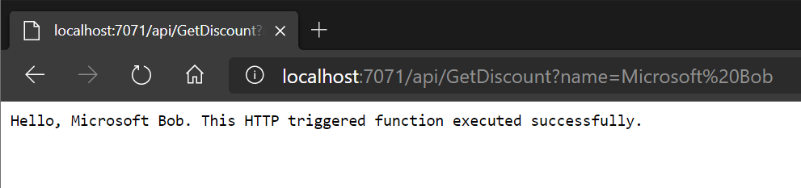

You can set a breakpoint in your Function code to step through it, as you'd expect. When you're happy, stop it running.

## Step 2: Add Business Logic

If our Function is going to **do** anything, it's likely that it will need to call some business logic to return an appropriate response. To make our code more testable and reusable, we'll add our business logic to a class library. We'll add that in this step.

- Right click on the solution in the Solution Explorer and select `Add -> New Project`  

  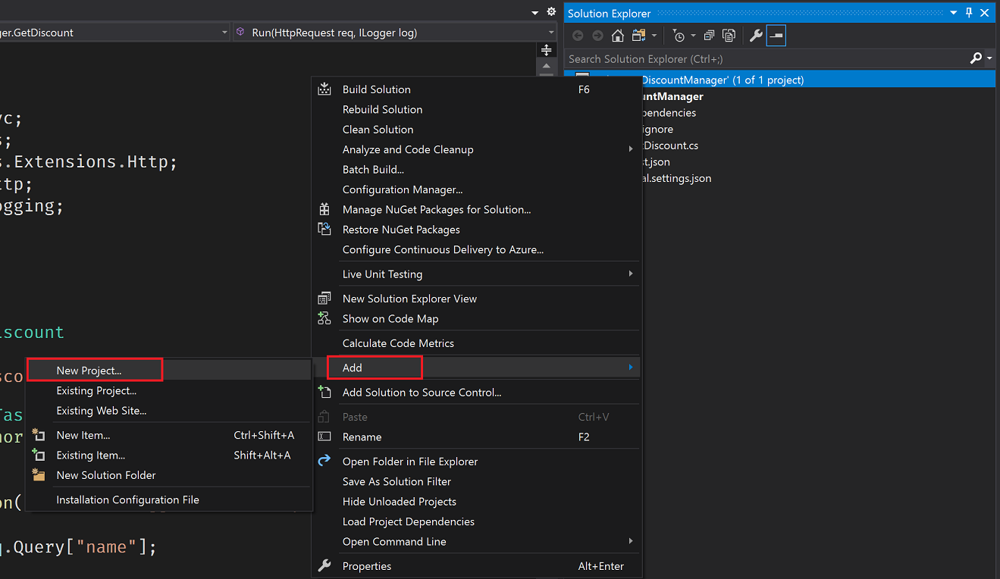

- Select `Class Library` and click `Next`  

  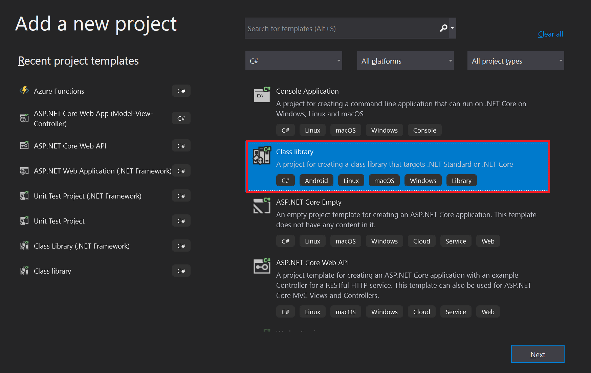
- Call it `DiscountManager.Shared` and click `Next`  

  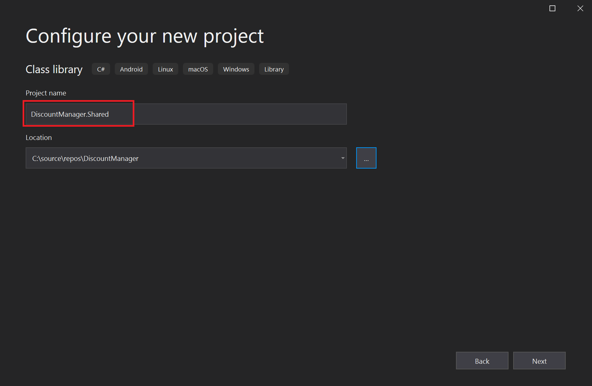

- Choose Target Framework as `.NET Core 3.1 (Long-term support)` and click `Create` 
- Delete the default `Class1`, and add a new Class, called `DiscountCalculator`.
- Make the class `public`, and add in the following code:  

  ```CSharp
  public double GetDiscountAmount(string dateJoined)
  {
      var date = DateTime.Parse(dateJoined);

      // difference the dates and return the appropriate discount based on years
      var diff = DateTime.Today - date;

      double discount;
      switch ((int)Math.Floor(diff.TotalDays / 365))
      {
          case 0:
              discount = 0;
              break;
          case 1:
              discount = 0.1;
              break;
          case 2:
          case 3:
          case 4:
              discount = 0.15;
              break;
          case 5:
              discount = 0.2;
              break;
          default:
              discount = 0.3;
              break;
      }

      return discount;
  }
  ```

  > *👆 The code above is not production ready. It's purely illustrative*

- Now we'll use this library in our Function, so back to the `GetDiscount.cs` code file in the `DiscountManager` project.
- Add the using statement:

  ```CSharp
  using DiscountManager.Shared;
  ```

- Add the following line **above** the run method:

  ```CSharp
  public static DiscountCalculator disCalc = new DiscountCalculator();
  ```

> *Add the references as required (in this case, add a project reference to the `DiscountManager.Shared` project from the `DiscountManager` project). The code above instantiates a new instance of our class, which will be shared across executions. You cannot instantiate dependencies in your `Run` method because it's a static method.*

- Change the Function code in the `Run` method to:

  ```CSharp
  log.LogInformation("C# HTTP trigger function processed a request.");
  string dateJoined = req.Query["dateJoined"];
  var discount = disCalc.GetDiscountAmount(dateJoined);
  return new OkObjectResult(discount);
  ```

- Now you should be able to run your Function again, supplying a new parameter `?dateJoined=`.
  - Hit `F5` to run your Function
  - Open a browser and load `http://localhost:7071/api/GetDiscount?dateJoined=2016-05-06`.
  - Debug the Function to make sure you're happy with it and experiment with some other dates. You should see the result in the browser:  

    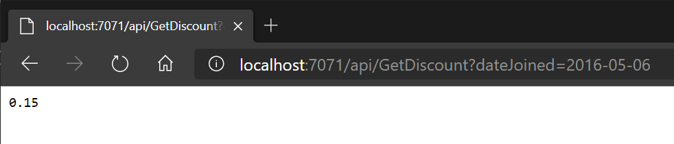

Great! We've now got a local Function implementing some business logic.

## Step 3: Writing Unit Tests

One reason we extracted as much logic *out* of the Function's `Run` method that we could was to make the code far more testable. Now we'll write a couple of standard unit tests for our business logic and briefly explore how we might unit test our *actual* Function too.

- Add a new `Unit Test Project` to your solution.  

  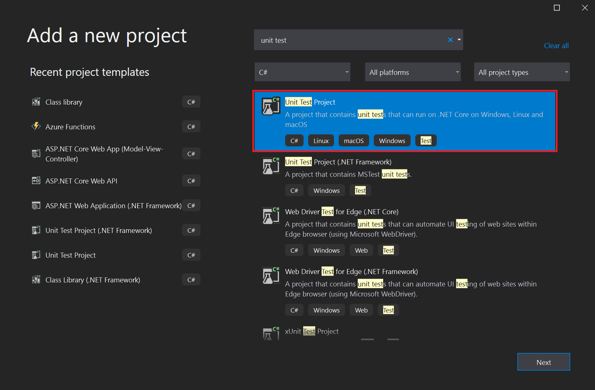

- Name it `DiscountManager.Tests` and click `Next`:  

  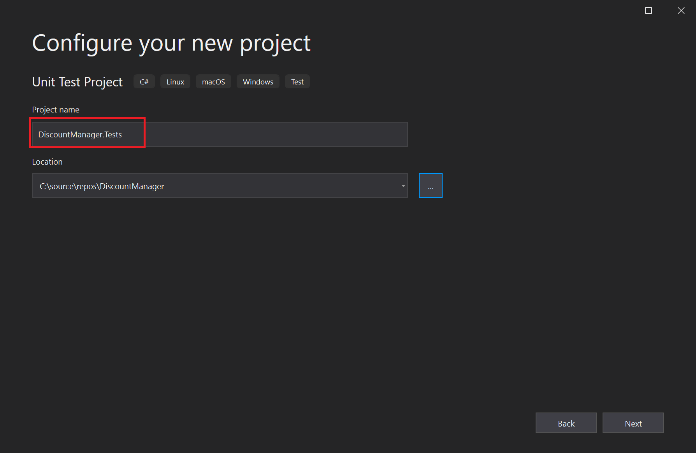

- Select Target Framework as `.NET Core 3.1 (Long-term support)` and click `Create`
- Rename the default test file as `DiscountCalculatorTests.cs`, and let Visual Studio rename the class (change it manually if it doesn't change automatically).
- Add a project reference to `DiscountManager.Shared`.
- Add the following tests (*Add references and using statements as required*):

  ```CSharp
  [TestMethod]
  public void TestDiscountUnderOneYear()
  {
      // arrange
      var disCalc = new DiscountCalculator();
      var dateJoined = DateTime.Today.AddDays(-1).ToString("yyyy-MM-dd");

      // act
      var discount = disCalc.GetDiscountAmount(dateJoined);

      // assert
      Assert.AreEqual(0, discount);
  }

  [TestMethod]
  public void TestDiscountOneYear()
  {
      // arrange
      var disCalc = new DiscountCalculator();
      var dateJoined = DateTime.Today.AddYears(-1).ToString("yyyy-MM-dd");

      // act
      var discount = disCalc.GetDiscountAmount(dateJoined);

      // assert
      Assert.AreEqual(0.1, discount);
  }

  [TestMethod]
  public void TestDiscountTwoYears()
  {
      // arrange
      var disCalc = new DiscountCalculator();
      var dateJoined = DateTime.Today.AddYears(-2).ToString("yyyy-MM-dd");

      // act
      var discount = disCalc.GetDiscountAmount(dateJoined);

      // assert
      Assert.AreEqual(0.15, discount);
  }
  ```

> *👆 Notice in the above tests, we don't hard-code the date. This means we won't have to keep changing the date as time passes!*

- Now you can run the tests. In Visual Studio, select `Test -> Debug All Tests`:  

  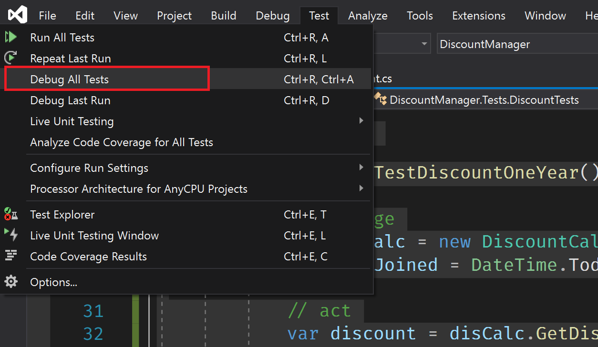

The tests should all pass - you can set breakpoints to step through as you wish.

### Unit Testing a Function

Since our Function has virtually no logic of its own, it's less likely that we would unit test it. However, you may want to test how a Function will respond given certain parameters.

To call the Function `run` method, we'll need to supply 2 parameters:

- `HttpRequest`
- `ILogger`

We can simply create dummy instances of these parameters. For more complex bindings and parameters, we might want to use a Mocking framework.

We'll add our test method to create a new `HttpRequest` and `log` objects and call our `run` method.

- Add a new test class to `DiscountManager.Tests` called `GetDiscountTests`
- Add a project reference from `DiscountManager.Tests` to `DiscountManager`. The test project now implicitly references everything the `DiscountManager` project does. We don't need to add additional references for the types being used in our test.
- Then add the following test method:

  ```CSharp
  [TestMethod]
  public void TestFunctionMethodOneYear()
  {
      // arrange
      var dateJoined = "2017-06-18";

      // create a dummy request object
      var ctx = new DefaultHttpRequest(new DefaultHttpContext())
      {
          QueryString = new QueryString($"?dateJoined={dateJoined}"),
          Method = "GET"
      };

      var log = NullLoggerFactory.Instance.CreateLogger("FunctionTestLogger");

      // act
      var result = (OkObjectResult)(GetDiscount.Run(ctx, log).Result);

      // assert
      Assert.AreEqual(0.15, result.Value);
  }
  ```

> *Add using statements as you go. Let Visual Studio help with this.*

## Step 4: Deploy to Azure

Now our Function is running locally, and is well tested - we can deploy it to Azure. In later labs (and for Production) we'll look at a continuous delivery pipeline, but for this lab we'll use the Visual Studio wizard.

- Right click your Functions project (`DiscountManager`) and select `Publish`. In the window that appears, select `Start`.  

  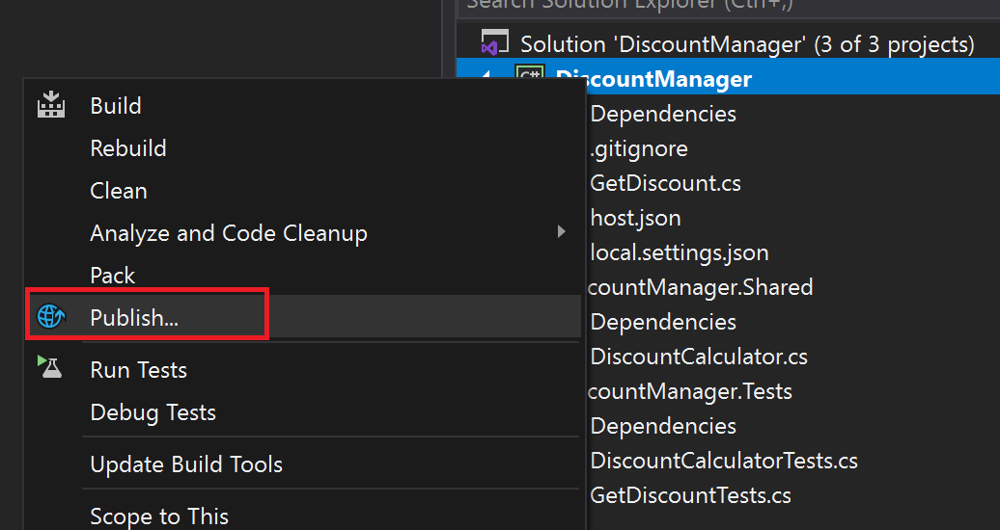

- Select Target as `Azure`
  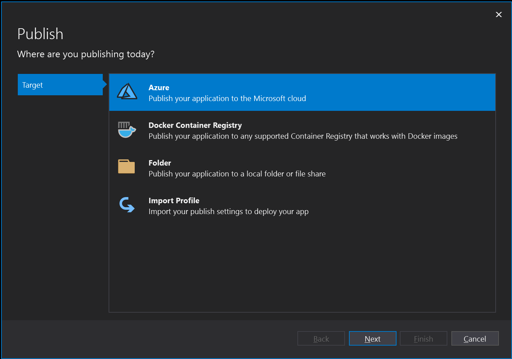
- Select Specific target as `Azure Function App (Windows)`
- Click the `+` sign to create a new Function App in Azure
  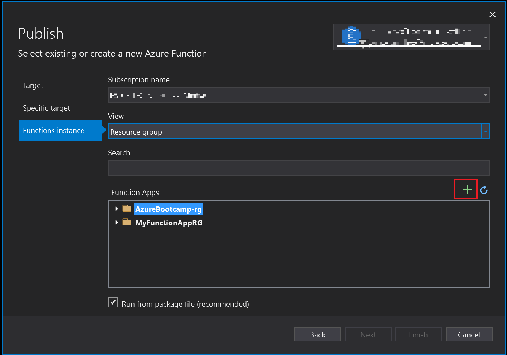
- The new publish profile wizard will be shown. Make sure the correct account is selected in the top right hand side. Complete the fields:  
  `App Name`: Must be globally unique, this will form the URL. Make a note of what this is.
  - `Subscription`: Select an appropriate subscription to deploy your function app into.
  - `Resource Group`: Create a new Resource Group and give it an appropriate name.
  - `Plan Type`: Set it to Consumption
  - `Location`: Select a location close to you (`UK South` or `UK West` tend to be the closest options).
  - `Storage Account`: Create a new Storage Account and give it an appropriate name. Make sure you select the same `Location` as you selected above.
  - Click `Create`. The resources will then be created in your Azure Subscription.

    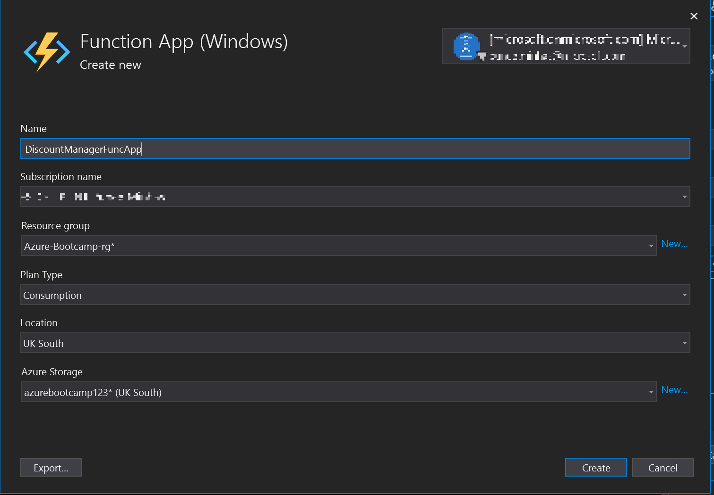

  - Click `Finish`
  - When done with creating the resources, publish the app. Also take some time to explore the options in the Publish Wizard.

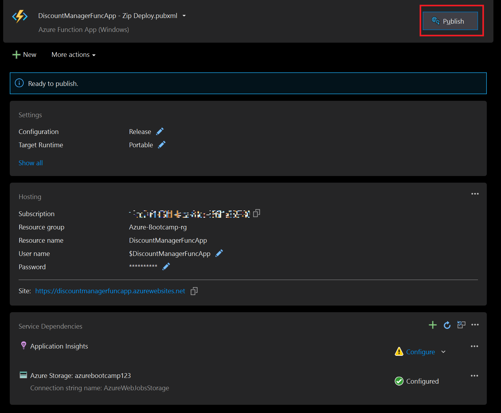

When the app is published to Azure, open your web browser and navigate to:

- <http://your-app-name.azurewebsites.net/api/GetDiscount?dateJoined=2010-01-02>:  

  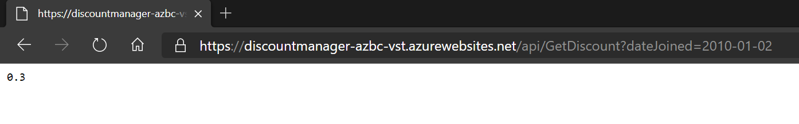

Awesome! A unit tested, pre-compiled Function running on Azure Functions v3, running in the cloud!

## Summary

We've covered a lot of ground in this lab. Let's recap.

You have:

- Created a new Function project using Visual Studio
- Added a shared class library to contain our business logic
- Added unit tests for the business logic *and* the Function
- Deployed it to the cloud.

## Stretch Goal

If you have some time left, there are some changes and improvements we can make.

Azure Functions now also supports dependency injection. This means Function methods can be even more testable. Try to modify the function we created in this lab to inject an instance of `DiscountCalculator` instead of creating an instance manually in the Function code.

### Hint

Take a look at the [Azure Functions Dependency Injection](https://docs.microsoft.com/en-us/azure/azure-functions/functions-dotnet-dependency-injection) documentation.
