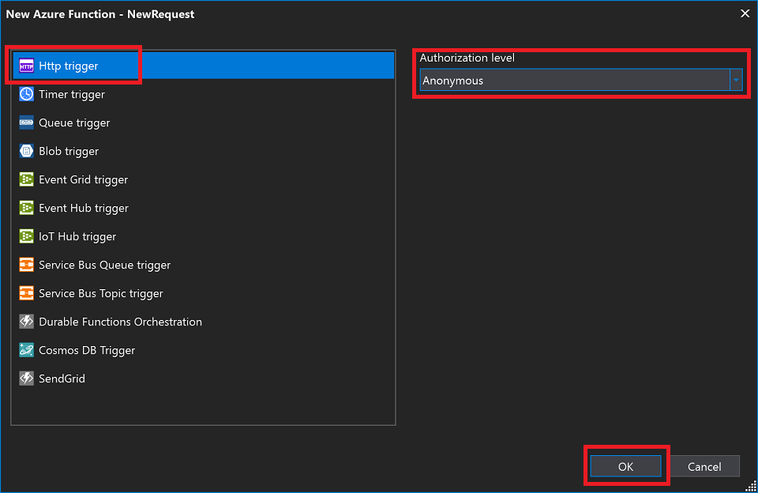
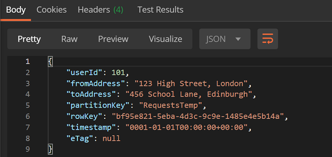

# Lab 3 - Triggers and Bindings

[Back to Main Menu](../../../README.md)

## Lab Summary

Contoso Cabs are building a proof of concept to use a new Azure Function as an API to receive taxi booking requests. The Function will accept a HTTP request and then log it to a Storage Queue for processing as well as a Table for audit.

In this lab you will learn how to:

- POST data to a Function and receive it as a custom object
- Use output bindings to pass data out of the function
- Use input bindings to retrieve and return data

*The steps in this lab use the Azure CLI. Many of the steps can also be performed in the Portal if required.*

## Step 1: Create Required Resources

(Note: change your resource location here as necessary. These samples use the UK South region)

- Open a command prompt / PowerShell window
- Type `az login` and hit return, then complete the sign in via the browser
- Type `az account list` and check that the subscription you want to use has `isDefault: true`

  ```json
  {
      "cloudName": "AzureCloud",
      "id": "dddddddd-0000-1111-aaaa-ffffffffffff",
      "isDefault": true, //⬅ Here
      "name": "Visual Studio Enterprise",
      "state": "Enabled",
      "tenantId": "dddddddd-0000-1111-aaaa-ffffffffffff",
      "user": {
          "name": "user@domain.com",
          "type": "user"
      }
  }
  ```

  - If the subscription you want to use does not have this, select the correct subscription:

    ```PowerShell
    az account set -s [Subscription-ID]
    ```

- Create a new Resource Group for this lab:

  ```PowerShell
  az group create --name BindingsLab --location uksouth
  ```

- Create a new Storage Account:

   ```PowerShell
  az storage account create --name [unique-name-for-storage-acct-here] --resource-group BindingsLab --location uksouth --sku Standard_LRS
  ```

- Create a new Storage Queue in your account:

  ```PowerShell
  az storage queue create --name bookingrequests --account-name [unique-name-for-storage-acct-here]
  ```

- Create a new Storage Table in your account:

  ```PowerShell
  az storage table create --name bookingrequests --account-name [unique-name-for-storage-acct-here]
  ```

We've now got our resource group and storage account with a queue and table ready.

## Step 2: Create a new Function App

In this step we'll create a new Function app that will accept a custom POCO (**P**lain **O**ld **C**LR **O**bject) object in a HTTP message, and will output details to your queue and table.

- Create a new Functions app in Visual Studio (just as you did in the last lab).
- Name the project `BookingRequest`:  

  

- Select the `Empty` template to avoid creating a new default function with the project and make sure `Azure Functions v3 (.NET Core)` is selected:  

  

- Right click on your project, `Add -> New Azure Function`:  

  
- Call your new Function `NewRequest`, and select the `Http trigger` template:  

    

  

- Add the NuGet Package `Microsoft.Azure.WebJobs.Extensions.Storage`

You'll now see the boilerplate HTTP Function code. Let's change it to accept a custom object from an HTTP Post:

- We'll be using 2 new POCO (**P**lain **O**ld **C**LR/**C**# **O**bjects) classes for this function, one that the user will see, and an internal one for the Azure Table.
  - Create the following classes below your function class:
  - VS will complain with a red underline that it doesn't understand TableEntity - resolve this to **Microsoft.WindowsAzure.Storage.Table**.

    ```CSharp
    public class TaxiRequest
    {
        public long UserId { get; set; }
        public string FromAddress { get; set; }
        public string ToAddress { get; set; }
        public string TrackingId {get; set; }
    }
    public class TaxiRequestEntity : TableEntity
    {
        public long UserId { get; set; }
        public string FromAddress { get; set; }
        public string ToAddress { get; set; }
    }
    ```

- Now replace the entire NewRequest function with the following. Notice that the HttpTrigger now takes a *TaxiRequest* object (this will be read from the body of an HTTP POST)
  - The code will ensure that the input from the POST is deserialized into a TaxiRequest object.
  - It will create an **TaxiRequestEntity** object, populate it with data from the *req* object.
  - There are 2 additional parameters which are the output bindings for the table and the queue.
    - We use an `IAsyncCollector<T>` for this since:
      - We need to return a value to the caller
      - We have more than one output binding

    ```CSharp
    [FunctionName("NewRequest")]
    public static async Task<IActionResult> Run(
        [HttpTrigger(AuthorizationLevel.Function, "post", Route = null)]TaxiRequest req,
        [Table("bookingrequests", Connection = "StorageConnectionString")] IAsyncCollector<TaxiRequestEntity> tableOutput,
        [Queue("bookingrequests", Connection = "StorageConnectionString")] IAsyncCollector<TaxiRequest> queueOutput,
        ILogger log)
    {
        log.LogInformation("C# HTTP trigger function processed a request.");

        string from = req.FromAddress;
        string to = req.ToAddress;
        long userID = req.UserId;

        // This is where you would do any custom business logic

        //Construct table output entity
        TaxiRequestEntity entity = new TaxiRequestEntity
        {
            RowKey = System.Guid.NewGuid().ToString(),
            PartitionKey = "RequestsTemp",
            UserId = userID,
            FromAddress = from,
            ToAddress = to
        };

        //Wait for the output to be sent to the queue and the table
        await Task.WhenAll(tableOutput.AddAsync(entity),
            queueOutput.AddAsync(req));

        return new OkObjectResult(entity);
    }
    ```

    >*👆 Notice how we create a new object to store in the table (with a Partition / Row Key), and we just output the GUID to the queue, returning a success message to the calling client. Table storage requires these extra properties. We also just sent the original request object to the queue.*

Save and make sure the code compiles.

### Add the Connection String

The last thing we need for our Function is to set the storage connection string. Let's get that, and set it in our `local.settings.json` file:

- Log in to <https://portal.azure.com>
- Navigate to your storage account (via the resource groups, or you can just search for it at the top of the portal page), and select `Access Keys`:  

  

- Copy the connection string to your clipboard:  

  

- Open your `local.settings.json` file in your Function project and add the following setting:  
  `"StorageConnectionString": "<your-connection-string-here>"`


## Step 3: Run & Test the Function Locally

You should now be able to hit `F5` and run your function locally. Make sure it starts correctly, and copy the URL we'll need to call:
(If you've been following the steps exactly it will be `http://localhost:7071/api/NewRequest`)


Since we're going to `POST` data to the function, we'll need to use a tool other than the browser. We'll be using Postman.

- Open Postman and Select the ➕ button to create a new request  

  

- Select `Post` for the method, and paste/type in the Request URL.
- Select the `Body` tab, and the `raw` radio button and change the content type to `JSON`.
- Add a new json object into the text area:

``` json
{
    "userId": 101,
    "fromAddress": "123 High Street, London",
    "toAddress": "456 School Lane, Edinburgh"
}
```


- Hit `Send`! If everything is working, you'll see a response object returned below, like this:  

  

>*Feel free to set break points in your Function to track what's going on.*

### Check the Output

To make sure our data is being saved properly we'll use the Azure Storage Explorer.

- Open the `Azure Storage Explorer` and log in
- Drill down into your Storage Account and have a look at the queue and table we created:  

    

    

  

## Stretch Goals

If you have extra time, here are some extra objectives.

## Step 4: Add a Function to process the messages

Now we have messages being logged in our queue, you'll create a new Function to process them.

Add a new `Queue Trigger` Function to your project to read the messages in the queue.

You can refer to the documentation page on the [Microsoft Documentation site](https://docs.microsoft.com/en-us/azure/azure-functions/functions-bindings-storage-queue) for hints.

For now, the function can read the message and do nothing with it. Set breakpoints and make sure it's being triggered correctly.

## Step 5: Add a Function to return all the requests

If you still have time, try to create one more Function that would return all the current requests from the table.

Use the documentation and examples on the [Microsoft Documentation site](https://docs.microsoft.com/en-us/azure/azure-functions/functions-bindings-storage-table?tabs=csharp) to add a Cloud Table input binding, and return the items to the caller.

## Recap

Quick recap of what we've accomplished in this lab:

- Created a new Azure Function triggered by a HTTP Post
- Accepted a custom object into our Function
- Added Output bindings for an Azure Storage Table and Queue (multiple output bindings!)
- If you had time, you explored adding new functions to the function app with bindings for Azure Storage Queues and Tables to process and return data
- Tested it all locally with Postman
