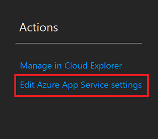
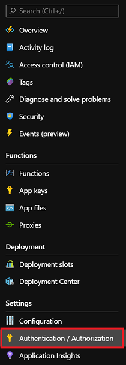
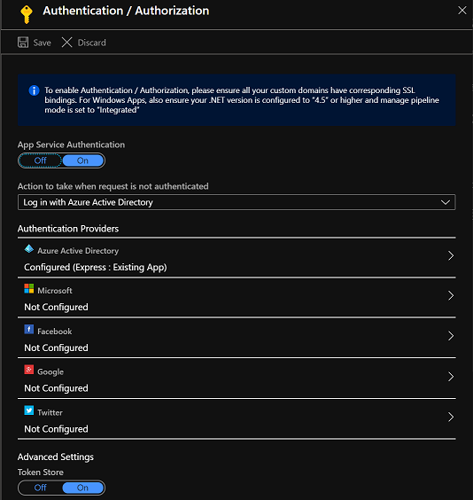

# Lab 6 Part 2 - Azure App Service Authentication

[Back to Function Security](Lab.md)

## Lab Summary

In this lab you will learn how to:

- Secure a Function with Azure Active Directory
- View the Identity and Claims information for the requestor

## Step 1: Deploy a Function App to Azure

We'll make use of the `DiscountManager` Function App you created in a previous module.

Open the solution and ensure that the authentication for the HTTP Function is set to **Anonymous**.

Deploy the Function App to Azure (or use the deployment you created earlier) and ensure that it works anonymously.
> 💡Hint - remember local settings don't get published to Azure during the deployment. You can modify the settings that are deployed using the `Edit Azure App Service Settings` option in the publish wizard:  


## Step 2: Enable App Service Authentication / Authorization

- In the Azure Portal, open your Function App and open up `Authentication/Authorization` from the menu on the left.  

  

- Turn on `App Service Authentication`
- Change the value for `Action to take when request is not authenticated` to `Log in with Azure Active Directory`
- Click the `Azure Active Directory` option under `Authentication Providers`
- Follow the wizard to enable Azure Active Directory authentication, using the Express settings.
- Click `Save` after completing the express configuration.
- When complete, the configuration should look similar to this:  

  

- Now test your Function to return the discount value in Postman.
- Test the same Function in the browser - *what happens*?

### View the `/.auth/me` endpoint

To see the token and claims information that can be available to your Function, navigate to the `/.auth/me` endpoint in the browser (ie **<https://myfunc.azurewebsites.net/.auth/me>**)

## Step 3: Get Identity and Claims in your Function

A recent addition to the runtime is the ability to 'inject' a parameter that will be pre-populated with all the identity and claims information. To do this, open your `GetDiscount` function, and add the `ClaimsPrincipal` parameter into the function signature:

```CSharp
public static async Task<IActionResult> Run(
            //other bindings and parameters omitted
            ClaimsPrincipal principal,
            ILogger log)
{
```

Use that parameter in your function logic to log information about the identity of the user, and deploy and test it. For example, you can get the name of the user using `principal.Identity.Name`.

>***Remember:** You can view the logs in the Azure Portal in realtime by selecting the Function in your Function App.*

## Summary

In this lab, you have learned how to easily require user identities when accessing your function app.
