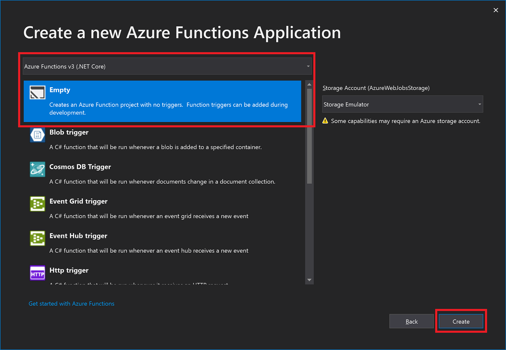
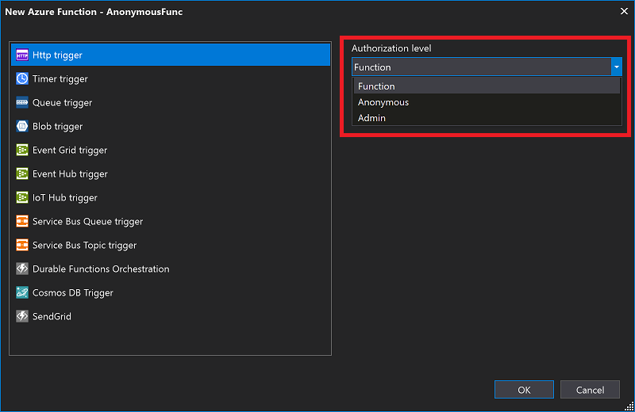
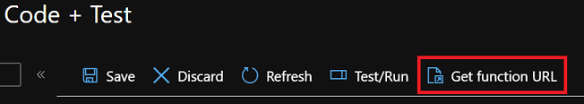

# Lab 6 Part 1 - Azure Functions Keys

[Back to Function Security](Lab.md)

## Lab Summary

Contoso Cabs need to have confidence that their Functions are secure and cannot be called by untrusted parties. In this lab, you will create a simple Function App to demonstrate how Functions can be secured with Keys.

In this lab you will learn how to:

- Apply a new Authorization Key to a Function
- Call the Function with the key

## Step 1. Create a new Function App in Visual Studio

- Open Visual Studio and create a new Azure Functions project
- Name the Function App `FunctionWithKeys`
- Select `Azure Function v3 (.NET Core)`, and `Empty` to avoid creating a default Function:  

  

- Add 3 functions to your project, selecting `Http trigger` and the appropriate `Access rights` in the dropdown:
  - AnonymousFunc - `Anonymous`
  - AdminFunc - `Admin`
  - FunctionKeyFunc - `Function`  

    

Note the different values in the `AuthorizationLevel` enum in the method parameters.

Leave the default code in place, it's not important for this lab

## Step 2. Test your Function App locally

- Hit F5 to start the Functions runtime locally
- Navigate to each Function in the browser, supplying a `?name=myname` query string parameter
  - *What do you notice, even for the secured Functions?*

## Step 3. Publish the Function App

- Right click on the Functions App -> Publish
- Publish your Function App to Azure, using the Consumption Plan
- When the App has published, try the online URL's (such as `http://<myfuncapp>.azurewebsites.net/api/AdminFunc?name=myname`)
  - *What response do you get?*

## Step 4. Call your published Functions using Keys

To retrieve your function keys, navigate to the Azure Portal, find your Function App and click through into it:

- Navigate to the functions section of your function app and for each function:
  - Click `Get function URL`:  

    

>***Note**: it's also possible to retrieve and set keys via the CLI, but that's outside the scope of this lab*

This dialog shows you the full Function URL, along with the `?code=` parameter.

- Copy this URL and try it in a browser.
- Try the different types of Function Keys with the different functions - for instance, try a Function Key on the `AdminFunc` Function

### If you've still got time

- Try using an API testing tool like Postman to call your secured functions
- Supply the key in the `x-functions-key` header in your `POST` request instead of in the querystring.
