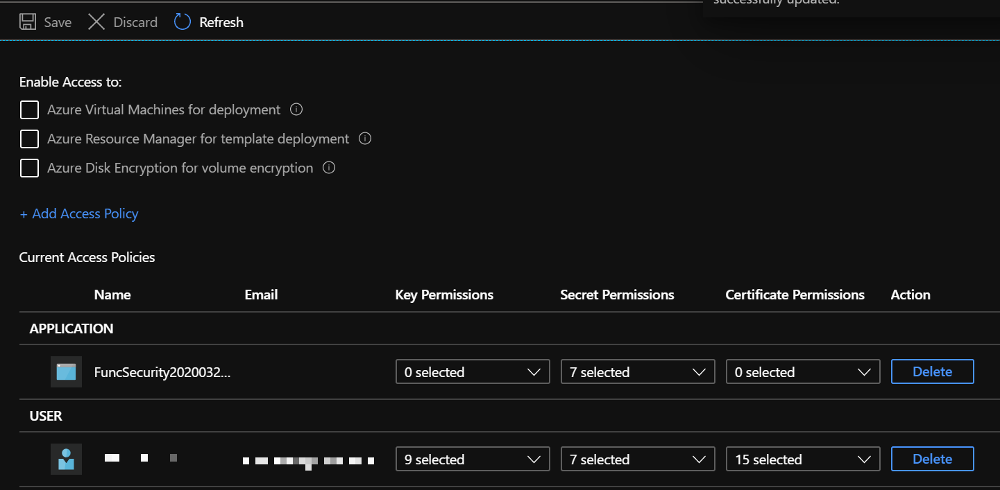

# Lab 6 Part 3 - Managed Identity and Key Vault References

[Back to Function Security](Lab.md)

## Lab Summary

The Contoso Cabs IT Operations Team store their secrets and connection strings in an Azure Key Vault. You need to implement a secure and abstracted way to retrieve these secrets. We also want to keep our code clean, avoiding boilerplate code where possible.

In this lab you will learn how to:

- Use Managed Identities and Key Vault References to read a secret from your Key Vault.

## Step 1: Create Required Resources

Log into the Azure Portal and create a new `Key Vault` resource.

- Name your vault appropriately, and choose a location and resource group (or create a new one).
- You can leave the other settings as default.
- Once your Key Vault has been provisioned, navigate to it and select `Secrets -> ➕Generate/Import`. Create a new secret:  
  
  

- Configure the following values:
  - `Upload Options`: Manual
  - `Name`: MyConStr
  - `Value`: SuperSecretConnectionString1234!
  - Click `Create`
- When the secret has been created, navigate into it and copy the `Secret Identifier` URI. It should end with a guid without dashes (this is the secret version).

## Step 2: Create a Function to read the Value

Add a function to your `FunctionWithKeys` solution from the part 1 of this lab. Remove the template code and retrieve and return the secret value from the settings like this:

```CSharp
var secretVal = Environment.GetEnvironmentVariable("MyVaultSecret");
return new OkObjectResult(secretVal);
```

Publish the Function App to Azure and open the function app in the portal.

### Enable Managed Identity

Now, we need to give our Function App an identity. Open your Function App in the Portal and select and select `Identity` in the menu on the left.


In the `System Assigned` section, change the `Status` to `On` and click `Save`.


### Add the Key Vault Reference

Now we need to add the Key Vault reference to the app settings:

- Navigate to your Function App -> `Configuration` section in the left hand menu.
- Add a new App Setting:
  - `Name`: MyVaultSecret
  - `Value`: `@Microsoft.KeyVault(SecretUri={[string-from-step-1]})`
  - Click `OK`
- Click `Save` to save the application settings

>⚠ **Notice:** The `Source` column tells us that the application setting value is coming from `Key Vault`. But it has a red ❌ against it...

Call the Function in the browser. What do you see?

>⚠ **We don't see the secret value because your Function App doesn't yet have permission to the Key Vault.**

## Step 3: Give the Identity access to Key Vault

Next we need to give our new managed identity access to our Key Vault. We'll do these steps in the Portal.

- Navigate to your Key Vault we created in Step 1
- Under `Settings`, click on the `Access Policies` section then click `➕ Add Access Policy':  
  
  

- For this lab, we'll select `Secret Management` for the `Configure from Template` option. In a real world scenario, it's best practice to apply the minimal permissions the application would need to this resource:  

  

- Select a Principal, and search for the name of your Function App you created in Step 2
- Select `Add`. You should now see your Function App listed in the access policy under the `APPLICATION` section.
- **Important:** Make sure you click `Save` to save the policy:  

  

- You should now see all the users or apps (Service Principals) which have access to this resource:  

  

## Step 4: Recycle the App and try again

Recycle your Function app by selecting the `Restart` option in you Function App in the Portal and call the Function again in the browser.

You should see your secret value printed to the screen. If you go back to the function app configuration section, the configuration value should now show that its source is Key Vault and it will have a green ✔ against it.

## Summary

There are a few moving parts here, so let's recap. You have:

- Created a key vault and added a secret
- Created a Function and Azure has given the Function App an identity
- Added an App Setting to the Function telling it which secret you want
- Given your Function App permission to read secrets in your key vault

>💡**Note:** The Function App code doesn't know that the secret is coming from a Key Vault. It is just loading a value from Environment Variables and doesn't need to know where it's coming from!
