# Lab 8 - Continuous Integration & Continuous Deployment (CI/CD)

[Back to Main Menu](../../../README.md)

## Objectives

The automated deployment of an Azure Function via Azure DevOps is made possible by the use of two [Azure Pipeline templates](https://docs.microsoft.com/en-us/azure/azure-functions/functions-how-to-azure-devops?tabs=csharp#template-based-pipeline) especially written by Microsoft. One exists for the compile & build of your Function's project *.csproj file, another for deployment.

 Whilst it was possible to deploy Functions before these templates were made available, the developer tended to have to "roll their solution" using out of the box build and deploy tasks. With these new dedicated templates this is no longer required and a CI/CD pipeline to deploy your custom function can be created in minutes.

## Requirements

- You will need access to an Azure DevOps organisation in order to create a new DevOps Project. Depending on the permissions your account has this may or may not be possible.
- If you are using a Microsoft Account (MSA) then these have the rights to create a limited number of Organisations and Projects. Corporate users should consult with their Azure DevOps admin.

## Step 1 - Upload your Azure Function project to Azure DevOps

1. **Connect to an Azure DevOps Organization**. 
    [**AzureBootcampSandbox**](https://dev.azure.com/azurebootcampsandbox)

1. **Create a new Azure DevOps Project**. An Azure DevOps Project contains all your source code, bugs & build pipelines etc. needed to build software in a team based environment. Follow the official Microsoft documentation on how to create a DevOps Project (inside the Organization you created above) - [Create a Project](https://docs.microsoft.com/en-us/azure/devops/organizations/projects/create-project?view=azure-devops)

   **Pro-Tip**:Don't use spaces in the Project name - use hyphens (-) or CamelCasing instead.

   >*You can read more about the purpose of an Azure DevOps project at [Azure DevOps Project Overview](https://docs.microsoft.com/en-gb/azure/devops-project/overview)*

   Make sure you keep a note of the new Project name - you'll need it soon.

1. **Create an Azure Function**. Create a new Azure Functions project using the Azure Functions Core Tools, making sure to use the HTTPTrigger (just as you have done in previous labs) and for the language `CSharp`.

   Open a command prompt or PowerShell at a location where you want to place you source code (such as `c:\src\repos`):

   ```PowerShell
   func init MyFunctionProj --dotnet
   cd MyFunctionProj
   func new --template "Http Trigger" --name TestFunc
   func start
   ```

   Then in a second command or PowerShell window, run the new function to check it is working:

   ```PowerShell
   start microsoft-edge:http://localhost:7071/api/TestFunc?name=Billy
   ```

   >**Note** 👆 This is another way to test a `GET` request in addition to opening a browser manually, using Postman or tools such as the `dotnet` tool `httprepl`. Use the tools you are most comfortable with.

   You may now stop the runtime from the first window by pressing `Ctrl+C`.

1. **Add the project to Git repository**. To push this project in `Azure DevOps`, you'll need to first initialize it with `Git`, add files to the repo, then commit the changes locally.

   From the *MyFunctionProj* folder, run the following:

   ```PowerShell
   git init
   git add .
   git commit -m "First project check-in"
   ```

1. **Push the changes into Azure DevOps**. You now need to push the changes from your local repo upto Azure DevOps.

   - Open a browser at: <https://dev.azure.com/YOURORGANISATION/_git/YOURPROJECTNAME> e.g. <https://dev.azure.com/ContosoCabs/_git/CI-CD-Demos> and find the `Push an existing repository from command line option` on that page.
   - Click the `copy` icon to grab the two lines of code into your copy buffer:  

      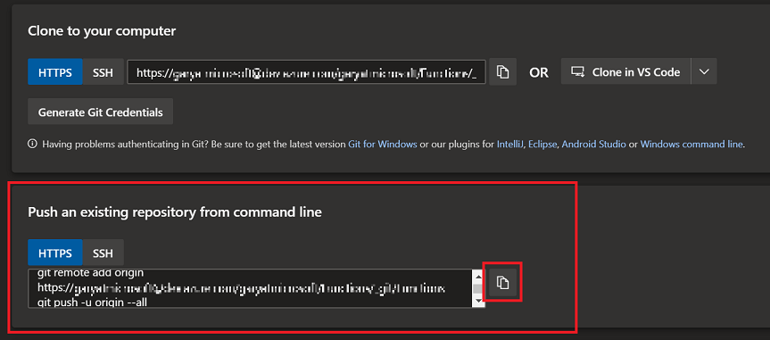

   - Now paste this into your command window (and press `Enter` to ensure the second line of the command executes too). This will push the changes up to Azure DevOps.
   - Reload your <https://dev.azure.com/YOURORGANISATION/_git/YOURPROJECTNAME> page and note the code has now been uploaded.

## Step 2 - Create an Azure Functions App

Previously you created Azure Function Apps using the portal, Visual Studio or VS Code, now you'll create one using the Azure CLI.

1. From the top menu bar in the Azure Portal, click the `Cloud Shell` icon in the top right.  

   

   >**Note** 💡 Cloud Shell allows you to run `Bash` or `PowerShell` scripts in the browser, instead of installing tools on your local machine. The Az CLI is installed and ready to use, as well as the `Az` PowerShell module. If this is the first time you have used Cloud Shell, you will be prompted to create a storage account for your profile.

   - Run the following commands (using either Bash or PowerShell). You will need to replace `UNIQUE_STORAGEACCOUNT_NAME` with a unique name for the storage account and `UNIQUE_FUNCTIONAPP_NAME` with a unique name for the Function app itself.

      ```PowerShell
      az group create -n MyFunctionAppRG -l uksouth

      az storage account create -n UNIQUE_STORAGEACCOUNT_NAME -g MyFunctionAppRG -l uksouth --sku Standard_LRS

      az functionapp create --consumption-plan-location uksouth --name UNIQUE_FUNCTIONAPP_NAME --os-type Windows --resource-group MyFunctionAppRG --runtime dotnet --storage-account UNIQUE_STORAGEACCOUNT_NAME --functions-version 3
      ```

      >**Note:** 🕑 It might take a few minutes for the resources to be visible in the Azure Portal.

## Step 3 - Create the deployment pipeline

You will now create a pipeline in Azure DevOps to build the newly uploaded project.

1. Open a new browser tab at: <https://dev.azure.com/YOURORGANISATION/YOURPROJECTNAME/_build> and click on the large blue **Create Pipeline** button in the middle of the screen.

1. Select to use the Classic Editor. This gives you a GUI for building the pipeline as opposed to having to write YAML code.  

   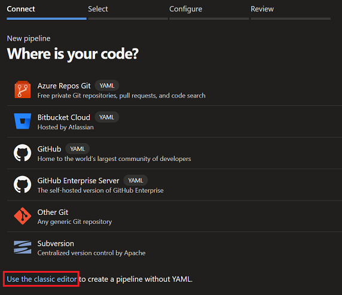

1. Accept all the defaults for source location and press `Continue`.  

   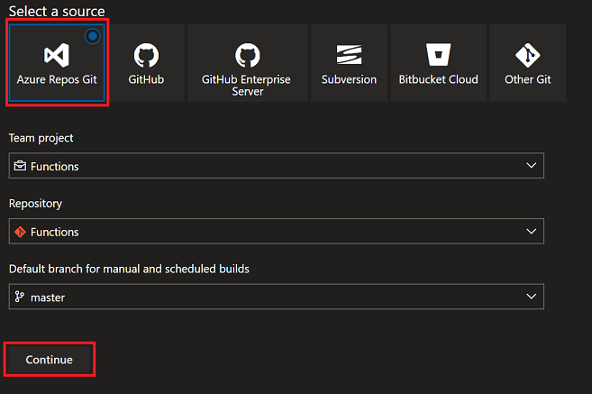

1. Choose the *Azure Functions for .NET* template and press **Apply**. *This adds 3 tasks to the pipeline, one to perform the dotnet build, one to zip the results, one to store the zip file back into Azure DevOps from where it can be used later when needed for deployment.* Take some time to explore the 3 tasks that have been added to the pipeline.  

   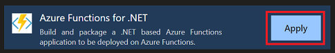

1. Press `Save & Queue` from the tool bar then `Save and Run` in the bottom right to start the build.

   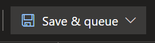

1. You can watch the progress by clicking on the `Agent Job 1` listed under `Jobs` on the next page that appears. You should then see a view similar to:  

   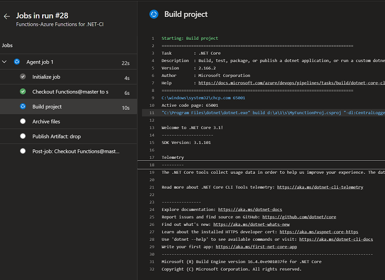

1. Once the build pipeline has completed, you can now create a Release pipeline.
8. We need to set up a Service Connection under `Project Settings` of the Azure DevOps project that will be used by the Release pipeline to connect to the Microsoft Azure Subscription. 
   >**Note:** For more information on Service Connections, you can visit [this](https://docs.microsoft.com/en-us/azure/devops/pipelines/library/service-endpoints?view=azure-devops&tabs=yaml) link.
     
    i. Under `Project Settings' (on the bottom left side of the page), click `Service Connections` and select `Create service connection`
    
     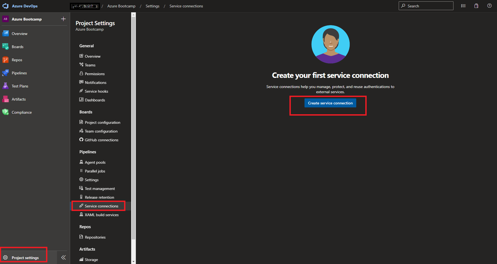

    i. Select `Azure Resource Manager` and click `Next`
    
       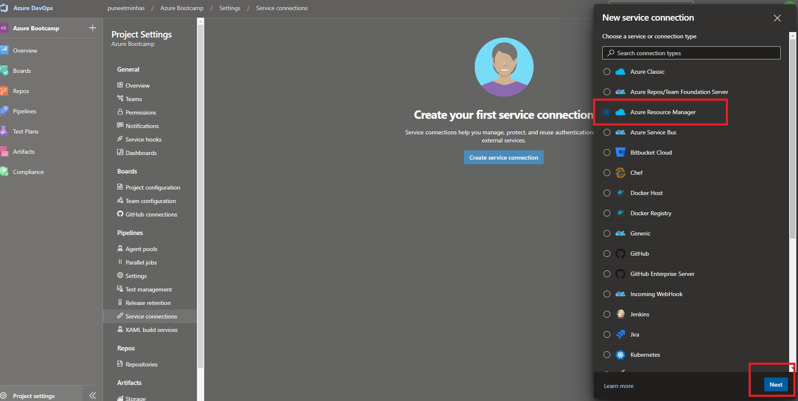
    1. Select `Service principal (manual)` and click `Next`
    
       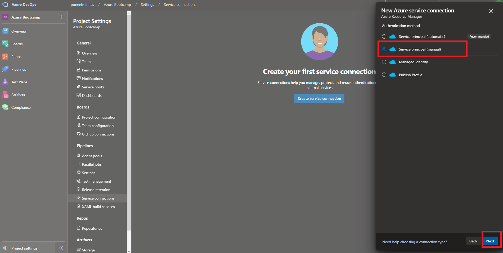

    2. Specify the details highlighted in red and click `Verify`
        >**Note:** If you do not have these details, please check with your Azure DevOps Admin.
        >Please do **NOT** share these details with anyone inside or outside your organisation.
      
       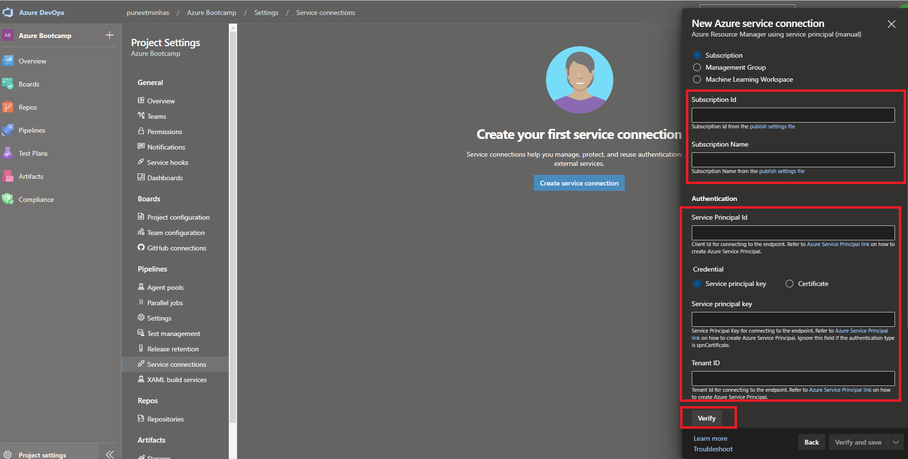
   
    3. Once the verification has succeeded, give a Service connection name, ensure `Grant access permissions to all pipelines` is checked, click `Verify and save`
      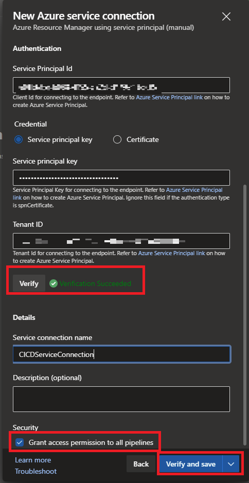

    4. You should now see a new Service Connection under Service Connections
      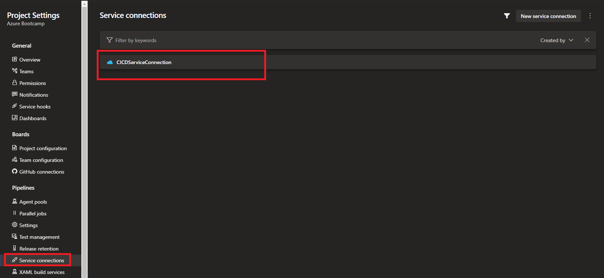

9.  On the left hand side, select `Pipelines -> Releases`.  

   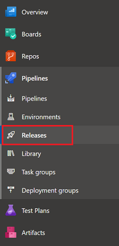

11. Next click the blue `New Pipeline` button in the middle of the page.

12. Select the *Deploy a function app to Azure Functions* template then press **Apply**.  

   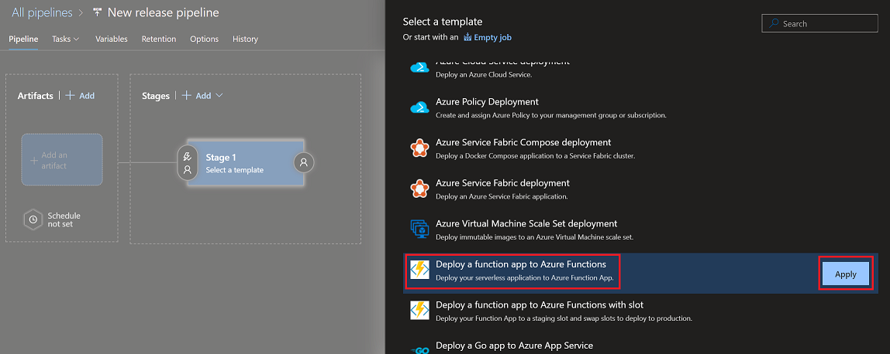

12. Change the *Stage name* value from *Stage 1* to *Production* then press the X to close the side bar property editor.

13. Next select the artifact that will be used when the release runs. This will be the artifact of the build pipeline.  

   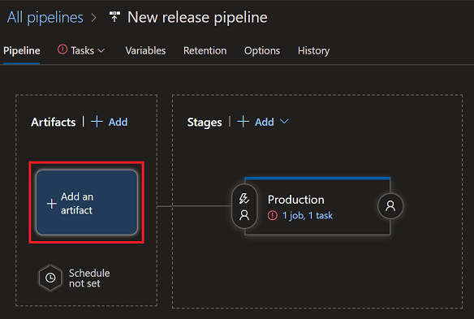

14. When prompted, select `Build` as the source type, and the `Source (build pipeline)` is the pipeline you have just created. Click `Add`.  

   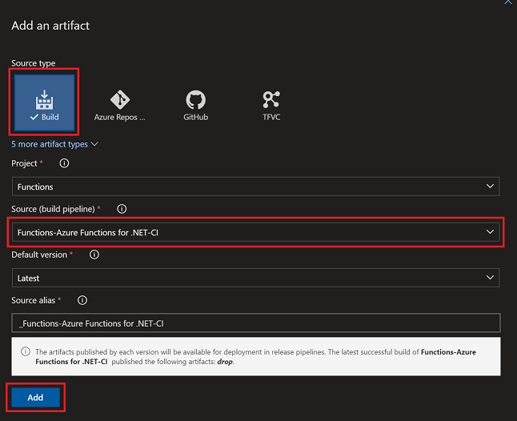

15. Click the stage edit link to open the pipeline properties.  

   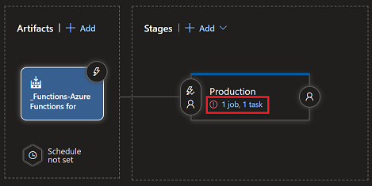

16. Select the service connection created previously and press **Authorize**.  

    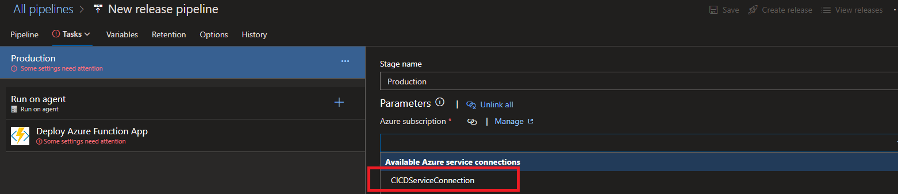)

17. For *App type* choose **Function App on Windows**.

18. For *App Service name* choose the Function App you created via the Az CLI command line earlier.

19. Press **Save** at the top of the screen, followed by **Create release** to the right of it. Confirm by pressing **Create** again, then click the *Release X has been created* link.  

   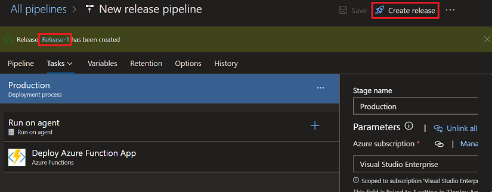

   Upon successful deployment, your screen will look like this:  

   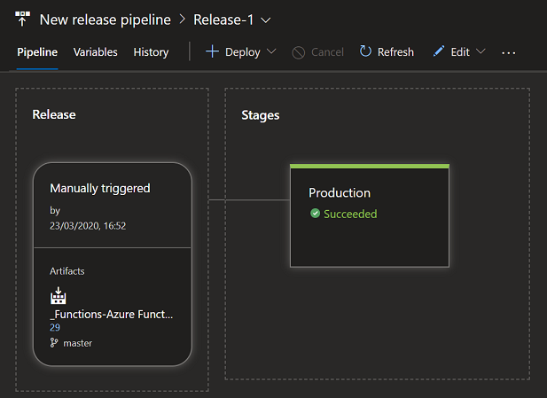

20. Test the site by opening the link to the Function (remember you can copy this from the portal), e.g. <https://myuniqueappname.azurewebsites.net/api/TestFunc?name=Bill&code=[my-function-key]>

## Summary

In this lab you have created a build pipeline and a release pipeline which will reliably deploy your Function App to the cloud. Using an automated pipeline improves the robustness of release processes by eliminating any manual steps which can be prone to mistakes.
